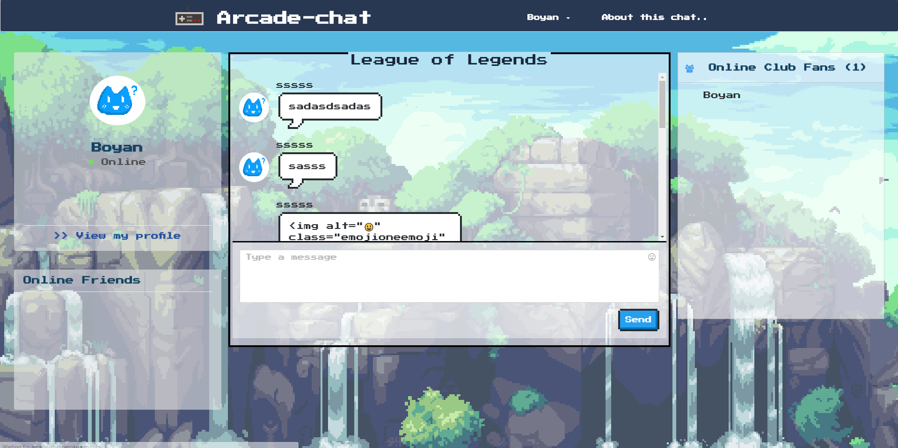
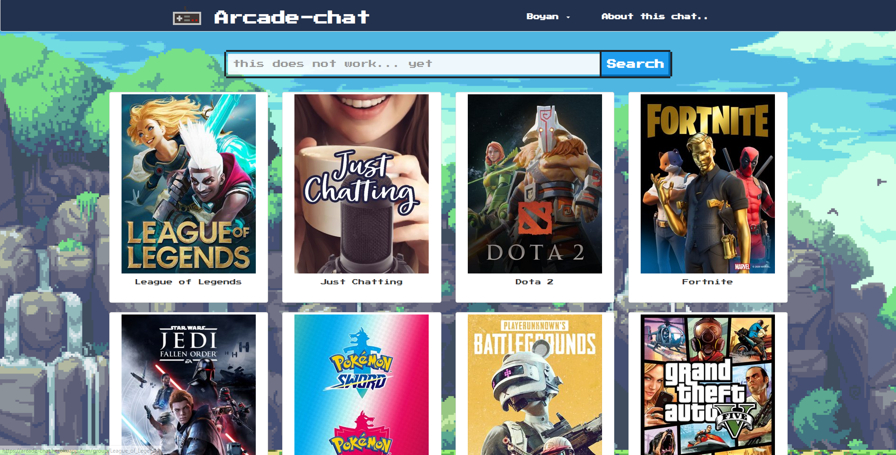
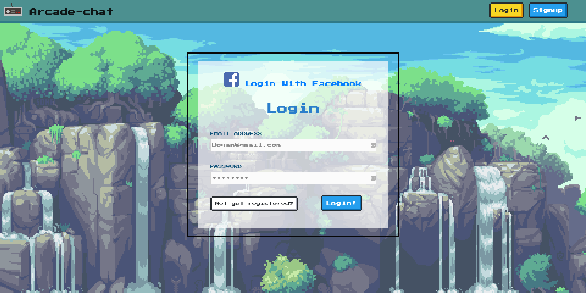

# chatting-room

node.js chatting room with socket.io

#### Tech Stack:

1. Vanilla Javascript
2. Node.js
3. MongoDB
4. Socket.io
5. NES.CSS framework
#### Some Functionality
1.Load room chat history from database
2.Create user and log in and log out
3.Send emoji 

#### Here are some pictures.

